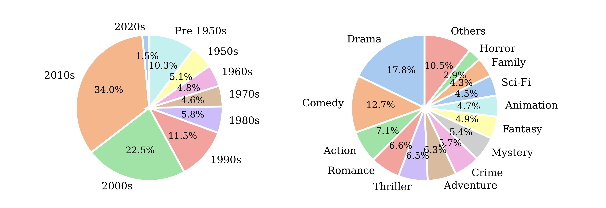
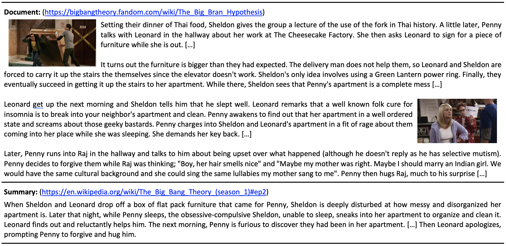

#  NarraSum


### What is NarraSum?

NarraSum is a large-scale abstractive narrative summarization dataset that is proposed in our EMNLP Findings 2022 paper [Learning-by-Narrating: Narrative Pre-Training for Zero-Shot Dialogue Comprehension](./).
It contains 122K (Document, Summary) pairs derived from plot descriptions of 22.8K unique movies and 28.5K unique TV episodes, which span a wide period and contain a broad range of genres.

<p align="center" width="100%">
     
</p>

We collect plot descriptions of movies and TV episodes from various movie websites. 
We then align plot descriptions in these resources that refer to the same movie or TV episode. 
Finally, we construct document-summary pairs by treating the long plot description as the document to be summarized and the shorter one (of the same movie or TV episode) as the corresponding summary.


<p align="center" width="100%">
     
</p>

The average length of documents and summaries is 785.97 and 147.06 tokens, and the average compression ratio is 5.34. 

### Why use NarraSum?

Compared with general text summarization, summarizing narratives faces unique challenges of plot and character understanding. 
From the plot’s perspective, the model needs to understand the causal and temporal relationships between events, as well as how the plot develops from the beginning to the end. 
From the character’s perspective, the model needs to understand the characters’ profiles, and how their desires and actions drive the story forward.
The paired document and summary data in NarraSum is a valuable resource to address these challenges and promote the related research. 

Besides narrative summarization, NarraSum can also benefit broader NLP tasks.
For example, in machine reading comprehension, the paired plot descriptions with low lexical overlap can improve the model’s capacity for complex reasoning and understanding. 
In narrative understanding, a summary of the narrative can help identify the salient event as well as the causal, temporal, and hierarchical relationships of events. 
In creative writing and storytelling, this dataset can support the research of expanding a short story outline to a more detailed story.

### Download

We provide a sampled dataset in this repository that contains 100 (document, summary) pairs. 
To download the entire dataset, please fill in this [Google Form](https://forms.gle/gw5vVc1XkiFLVnqP6)
and we'll send the link to your email address within a week.


### Related Data
If you are interested in understanding, narrating, and summarizing dialogues, Please check out [DIANA](https://github.com/zhaochaocs/Diana), 
a large-scale dialogue-narrative parallel corpus that is proposed in our ACL 2022 paper [Learning-by-Narrating: Narrative Pre-Training for Zero-Shot Dialogue Comprehension](https://aclanthology.org/2022.acl-short.23.pdf).
It contains 243K (DIAlogue, NArrative) pairs derived from subtitles and synopses of 47K English movies and TV episodes.


### Citation 

```bibtex
@inproceedings{zhao-etal-2022-narrasum,
    title = "NARRASUM: A Large-Scale Dataset for Abstractive Narrative Summarization",
    author = "Zhao, Chao  and
      Brahman, Faeze  and
      Song, Kaiqiang  and
      Yao, Wenlin  and
      Yu, Dian  and
      Chaturvedi, Snigdha",
    booktitle = "Findings of the Association for Computational Linguistics: EMNLP 2022",
    month = dec,
    year = "2022",
}
```
